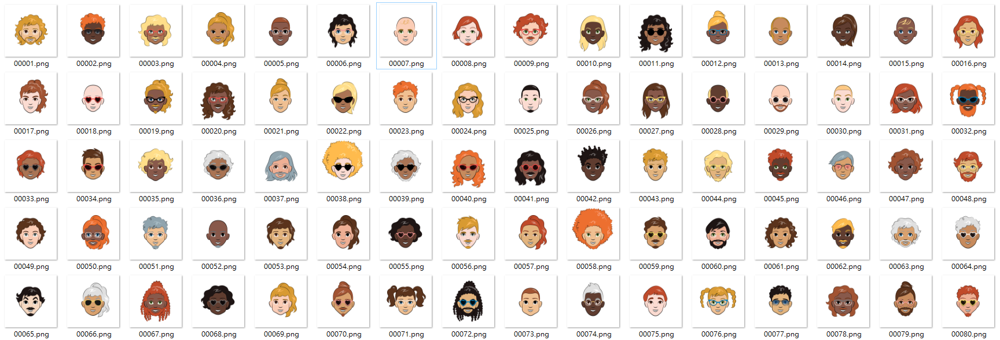

# CartoonGAN
Implement GAN to generate cartoon image

## Preparation
1. Download the image data from [Google Drive](https://drive.google.com/file/d/1ohoXETVeFg-LGkzGupwIprKON57dT3Hc/view?usp=sharing) (447MB). The ZIP file includes 10000 500x500 PNG images, as illustrated below:

2. Adjust the required paramters in `config.ini`
```ini
[default]
# Number of training epochs
epoch = 1000
# Save the model each n epochs
save_per_epoch = 20
# Sampling size of generating image each epoch
sample_size = 8

# The image size of generating image
img_size = 64
# The number of image channels (should be always RGB)
img_channel = 3
# The dimension of input noise of generator
noise_size = 32
# Batch size
batch_size = 256

[path]
# The folder path of images
data_src = ./Data/cartoon/
# The folder path of saved models
model_src = ./Pickle/
# The folder path for saving the generated samples
sample_src = ./Sample/
[cuda]
# The device string (training on CPU if device=cpu, or GPU if device=cuda)
device = cuda:0
```
**WARNING**: The CNN layers of generator and discriminator must be modified if `img_size` is changed! The architecture of these model can be modified in `model.py`.

## Run
For PyTorch user`python main_torch.py`

For Keras user `python main_keras.py`

**NOTE** The keras version has not been modularized yet, it may be completed in next several commits.